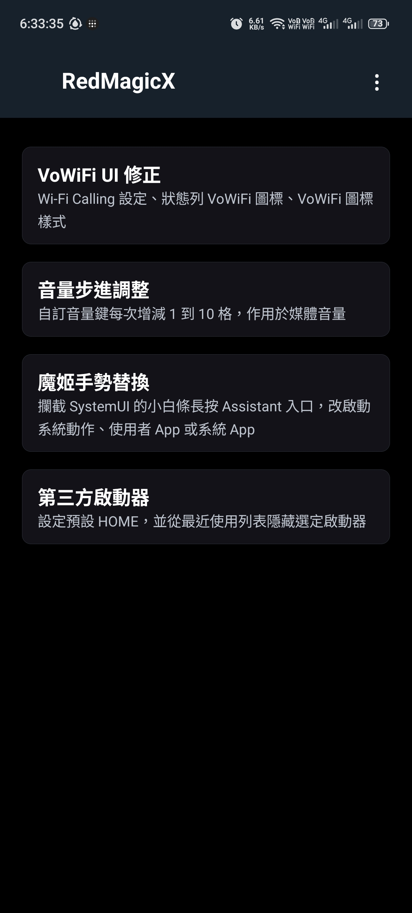
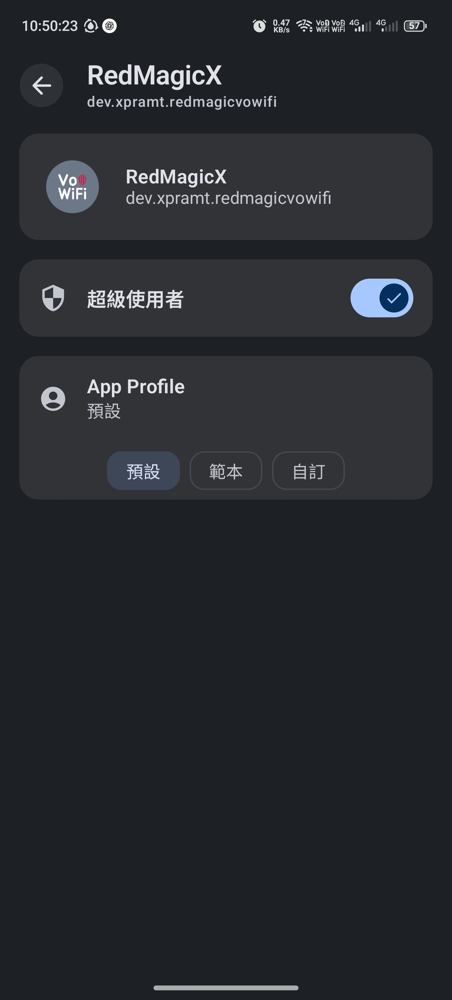
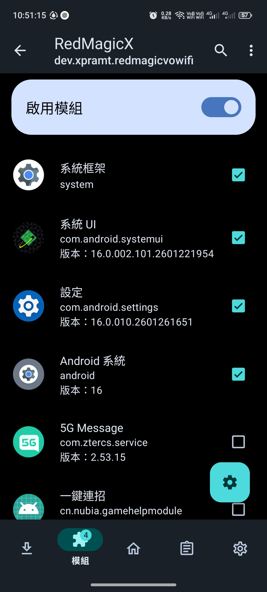
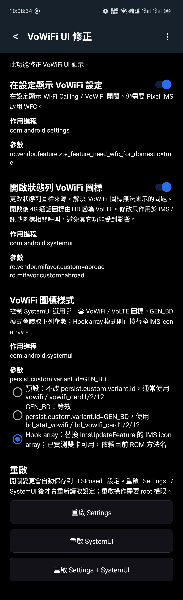
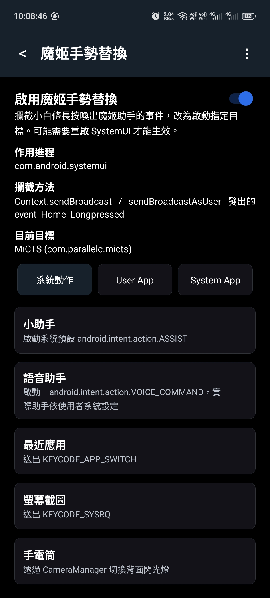

# RedMagicX

語言：[English](README.md) | 繁體中文

非官方 RedMagic 系統調整工具，用於 VoWiFi UI、音量步進、小白條助手手勢替換、第三方啟動器控制。

測試裝置：RedMagic / Nubia NX809J 中國版 ROM。其它 RedMagic / Nubia 機型尚未測試，但若 Settings/SystemUI 使用相同 ZTE 屬性與類別，理論上可能可用。



## 目錄

- [安裝](#安裝)
- [LSPosed 作用域](#lsposed-作用域)
- [功能](#功能)
  - [VoWiFi UI 修正](#vowifi-ui-修正)
  - [音量步進調整](#音量步進調整)
  - [魔姬手勢替換](#魔姬手勢替換)
  - [第三方啟動器控制](#第三方啟動器控制)
- [編譯](#編譯)
- [注意事項](#注意事項)

## 安裝

從 [GitHub Releases](https://github.com/XPRAMT/RedMagicX/releases) 下載 APK 後，直接在手機上安裝即可。

VoWiFi 電信商能力本身仍需要 [Pixel IMS](https://github.com/kyujin-cho/pixel-volte-patch) 或等效 carrier-config 修改。請先安裝 Pixel IMS 並用它開啟 VoWiFi。RedMagicX 主要修正中國版 ROM 的 UI 行為：設定頁缺少 VoWiFi 開關，以及狀態列 VoWiFi 圖標顯示問題。

使用 App 內重啟進程按鈕時，請授予 root 權限：



## LSPosed 作用域

在 LSPosed 啟用 RedMagicX，並依照使用功能勾選作用域：

| 功能 | 需要作用域 |
|---|---|
| VoWiFi UI 修正 | `com.android.settings`、`com.android.systemui` |
| 音量步進調整 | `android` / System Framework |
| 魔姬手勢替換 | `com.android.systemui` |
| 第三方啟動器控制 | `com.zte.mifavor.launcher` |

修改 VoWiFi 或手勢設定後，可在 App 內重啟 Settings/SystemUI，讓目標進程重新讀取設定。

在 LSPosed 內選擇作用域：



## 功能

### VoWiFi UI 修正

只透過 LSPosed hook 修正中國版 ROM 的 VoWiFi UI 行為，不寫入全域 `resetprop` 值。



開關對應：

| 開關 | Hook 目標 | 行為 |
|---|---|---|
| `開啟 VoWiFi 設定` | `com.android.settings` | 讓 Settings 讀到 `ro.vendor.feature.zte_feature_need_wfc_for_domestic=true`，顯示 Wi-Fi Calling / VoWiFi 開關。 |
| `開啟狀態列 VoWiFi 圖標` | `com.android.systemui` | 只讓 IMS/狀態列圖標程式碼讀到 `ro.vendor.mifavor.custom=abroad` / `ro.mifavor.custom=abroad`，navigation/assistant 相關程式碼維持 `home`，避免小白條手勢失效。 |
| `VoWiFi 圖標樣式 = GEN_BD` | `com.android.systemui` | 讓 SystemUI 讀到 `persist.custom.variant.id=GEN_BD`，使用 BD 樣式 VoWiFi 資源。切換後重啟 SystemUI 生效。 |
| `VoWiFi 圖標樣式 = Hook array` | `com.android.systemui` | 把 IMS icon array 回傳結果替換成 BD array。目前 NX809J ROM 已實測雙卡可用，但依賴目前 ROM 方法名。 |

VoWiFi 圖標樣式對照：

預設樣式使用 `statusbar_vowifi.svg`：


BD 樣式使用 `bd_stat_vowifi.svg`：


### 音量步進調整

自訂按一次實體音量鍵時，媒體音量增減的格數。


- 範圍：`1` 到 `10`
- Hook 目標：Android/System Framework
- 效果：透過 LSPosed 修改媒體音量鍵調整行為

### 魔姬手勢替換

攔截 RedMagic 底部小白條長按 assistant 事件，改啟動指定目標。



可選目標：

- 系統動作：小助手、語音助手、最近應用、螢幕截圖、手電筒
- 使用者 App
- 系統 App

此功能不修改系統預設 assistant 設定，而是在 SystemUI 開啟原本助手目標前攔截並替換。

### 第三方啟動器控制

將選定的第三方啟動器設為預設 HOME，並避免該啟動器出現在最近使用 App 列表。

- 啟動器選擇：列出可處理 `android.intent.action.MAIN` + `android.intent.category.HOME` 的 App
- 套用預設啟動器：透過 root 執行 Android 內建的 `cmd package set-home-activity --user 0 <component>`；無 root 時可透過 Shizuku shell 權限執行
- 最近任務過濾：Hook 紅魔 Launcher `RecentsView#onGestureAnimationStart`，阻止選定第三方 HOME task 被手勢流程補成 current-task 卡片
- 作用域需求：LSPosed 需勾選 `com.zte.mifavor.launcher`，並重啟紅魔 Launcher 或手機讓 Launcher 進程載入模組

## 編譯

```powershell
& 'C:\Users\XPRAMT\.gradle\wrapper\dists\gradle-8.13-bin\5xuhj0ry160q40clulazy9h7d\gradle-8.13\bin\gradle.bat' -p 'D:\Android\ZTE\VoWiFI\lsposed-redmagic-vowifi' assembleDebug
```

APK 輸出位置：

```text
app\build\outputs\apk\debug\app-debug.apk
```

## 注意事項

- RedMagicX 使用 LSPosed `XSharedPreferences`。
- 模組宣告 `xposedminversion=93` 與 `xposedsharedprefs=true`。
- 為了升級相容性，package name 保持 `dev.xpramt.redmagicvowifi`。
- 本專案為非官方工具，與 RedMagic、Nubia、ZTE 無關。
